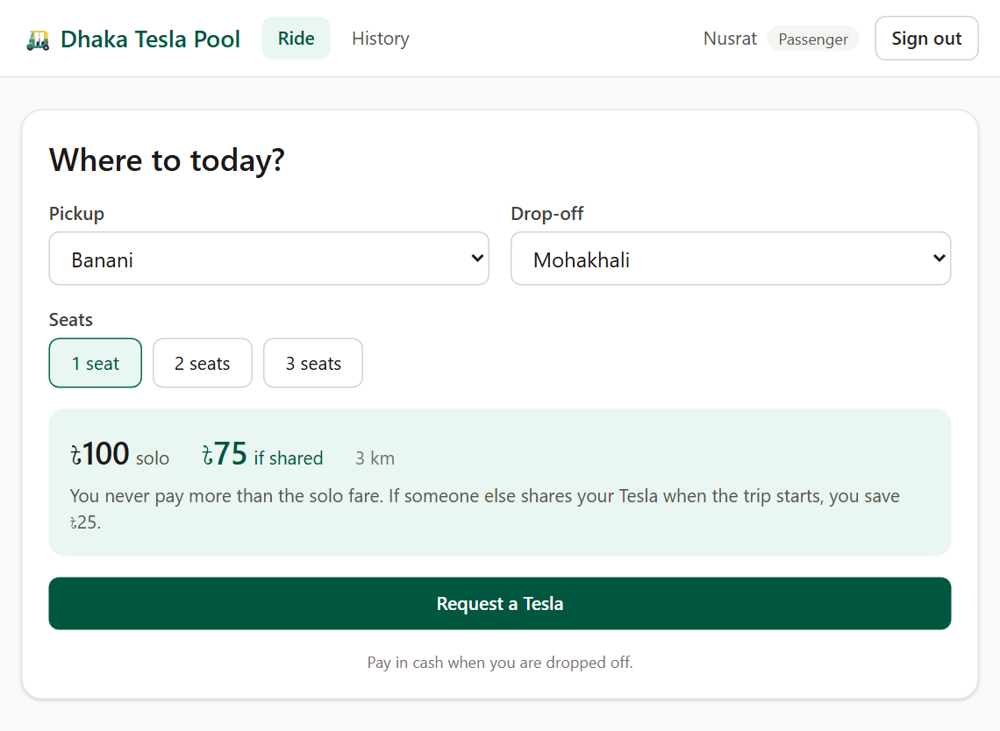
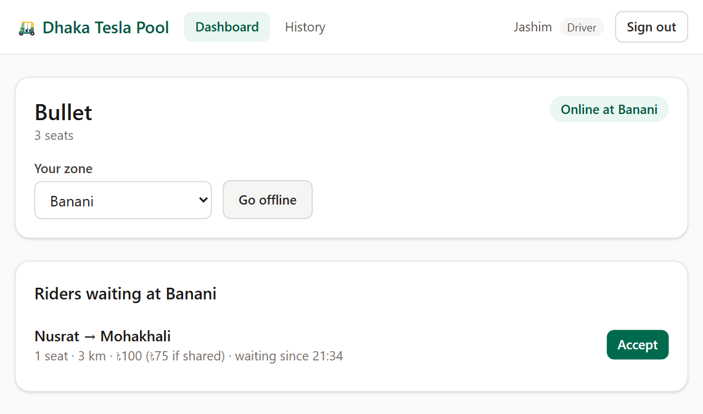
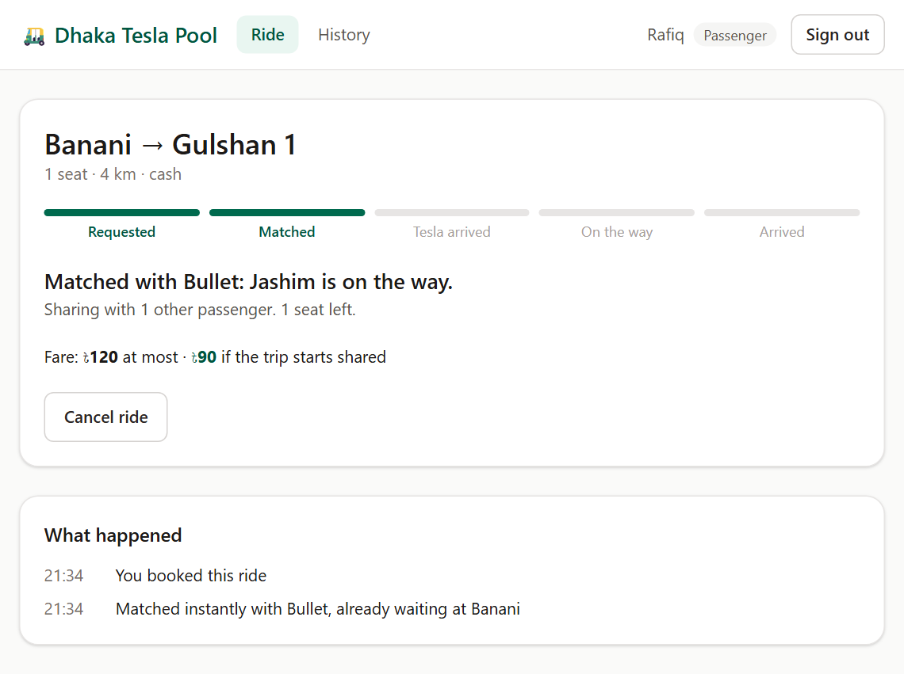
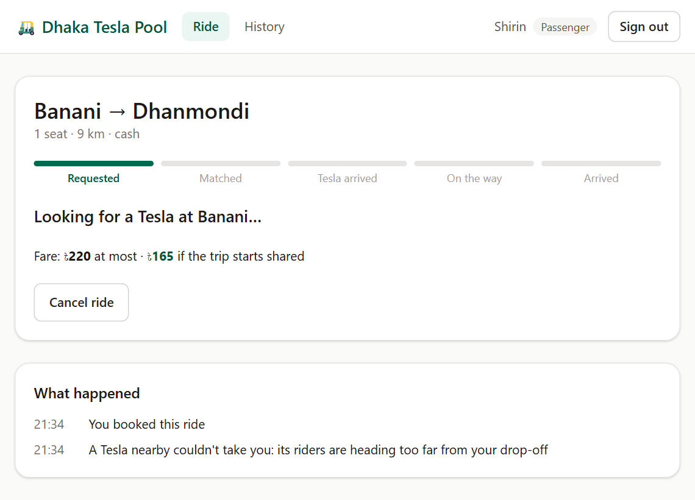
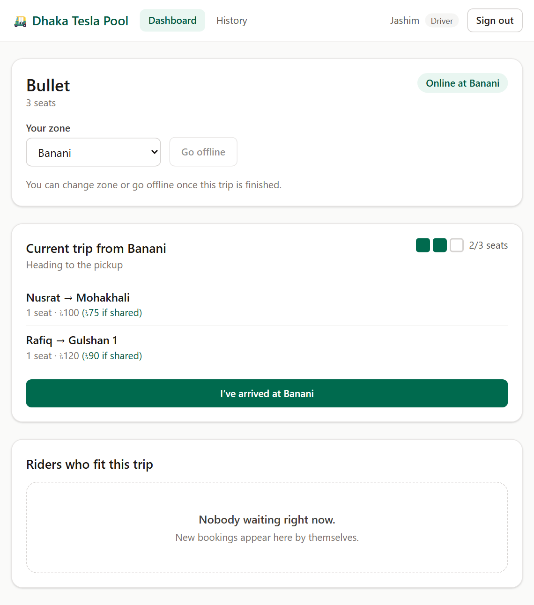
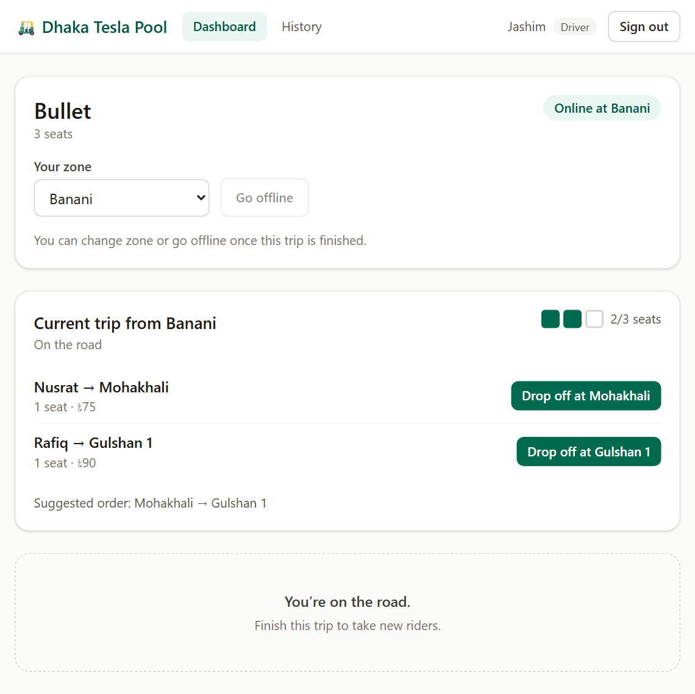
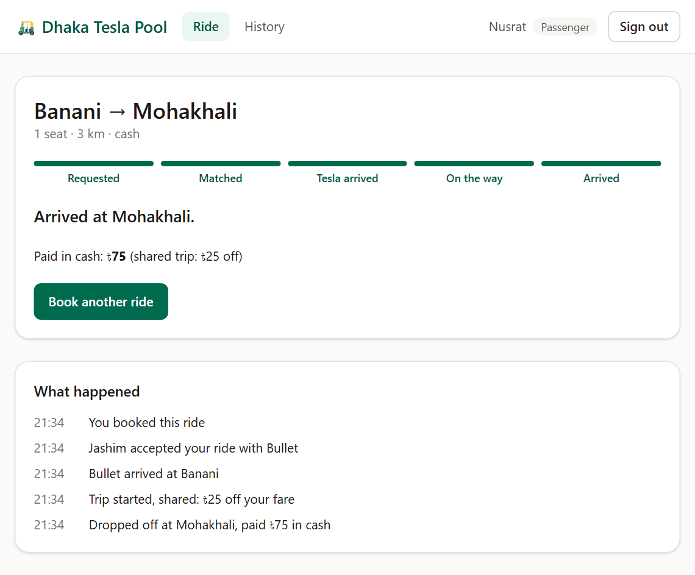
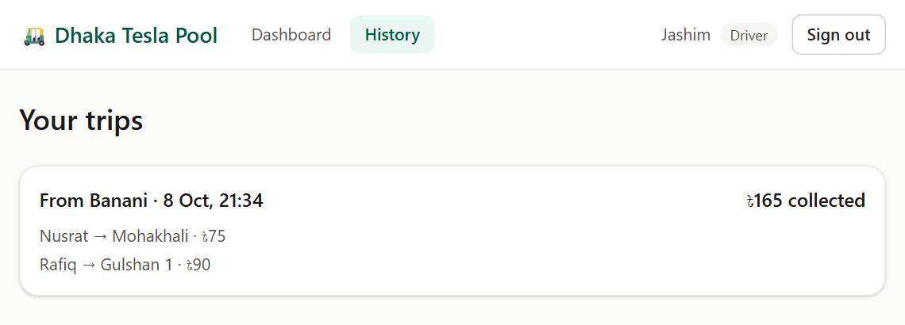
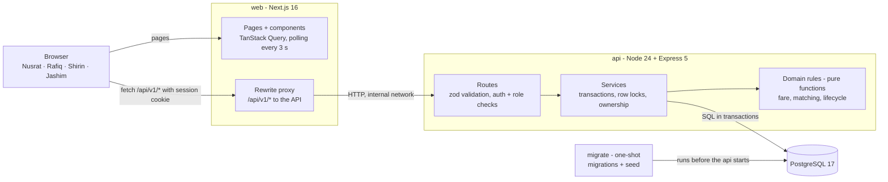
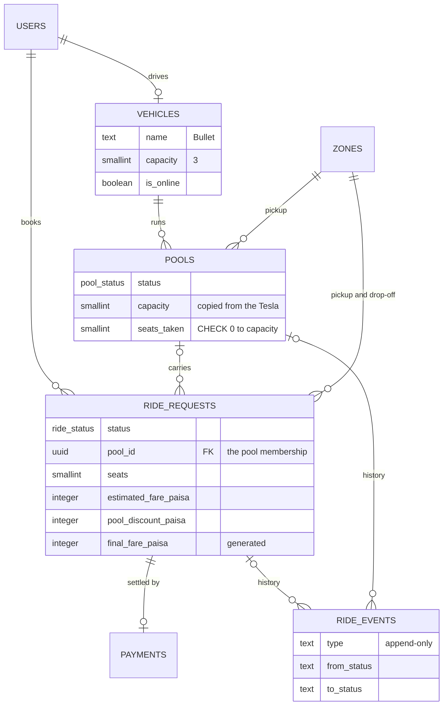

# Dhaka Tesla Pool 🛺

> Share a seat. Split the fare. Survive Dhaka traffic.

A ride-pooling MVP for Dhaka. Passengers book a ride from one zone to another. When their trips fit together, they share
one three-seat battery "Tesla", each paying their own fair fare, while the driver sees exactly who is riding and what
stage the trip is in. Built for the RoBenDevs engineering challenge with the story's cast: **Jashim** and his Tesla
**Bullet** (3 seats), and passengers **Nusrat**, **Rafiq** and **Shirin**.

> **Status: pre-release.** The live demo URL, the demo video and the AI usage notes are added with the v1.0.0 release.

[Run it](#run-it-with-docker) · [Demo accounts](#demo-accounts) · [Screenshots](#screenshots) ·
[Architecture](#architecture) · [Fares](#fares-check-them-by-hand) · [The last seat](#the-last-seat-nusrat-vs-shirin) ·
[API](#api-overview) · [Tests](#tests) · [Decisions](#key-decisions-and-trade-offs) · [Scaling](docs/scaling.md)

## The problem
Every morning in Banani, people stand at the same curb waiting for a battery rickshaw going roughly the same way. If two
of them could share one, both would pay less and the driver would earn more per trip. The app has to:
- decide in about a second whether two riders can share (same pickup, drop-offs close enough);
- **never sell more seats than the Tesla has**, even when two people grab the last seat at the same instant;
- charge each passenger their own fare and show them only their own ride;
- let the driver see his riders and move the trip through its stages, keeping every step as history.

**The story.** 08:41 at Banani: Jashim goes online with Bullet. Nusrat books Banani → Mohakhali and Jashim accepts. Two
minutes later Rafiq books Banani → Gulshan 1 and joins Bullet automatically, because his drop-off is 2 km from Nusrat's.
Shirin then goes for the last seat (in the tests, she and Nusrat grab it at the same instant). Jashim drops Nusrat off
first: she pays ৳75 instead of ৳100, Rafiq ৳90 instead of ৳120, and Jashim collects ৳165 for one trip.

## Features
**Passengers**
- Sign up and sign in (session in an HttpOnly cookie); one-click demo accounts on the sign-in page.
- Choose pickup, drop-off and 1–3 seats; see the fare before booking: solo, and the lower price if the trip is shared.
- Request a Tesla. If a compatible Tesla is already waiting at the pickup, the ride joins it instantly; otherwise it
  waits for a driver.
- Follow the ride live: status steps, the Tesla and driver, how many others share it (never their names or fares), the
  fare, and a "What happened" timeline that also explains why a ride is still waiting.
- Cancel free of charge until the trip starts; see past rides.

**Drivers**
- Go online or offline in a zone; see riders waiting there (once a trip is open, only those who fit it).
- Accept a rider to open a trip; compatible riders who book later join it automatically.
- See the seat meter and each rider's drop-off and fare; mark arrival; start the trip (fares lock, 25 % off when
  shared); drop riders off one by one with a suggested order; the cash payment is recorded at each drop-off.
- Trip history with what was collected.

**Under the hood**
- Seats can't be oversold: a row lock per trip plus a database `CHECK`, proven by a 20-round parallel race test.
- Two linked lifecycles (ride and trip), invalid moves rejected with 409, and every step stored as an event.
- Ownership enforced in every query: someone else's ride answers 404, exactly like a missing one.
- Validation on every input, one error format with request ids, rate-limited sign-in, security headers.
- `docker compose up` migrates and seeds the cast; CI checks the API, the web app and the compose stack.

## Screenshots
| | |
|---|---|
|  |  |
| **Nusrat** sees both prices before she books | **Jashim** sees her waiting at Banani and accepts |
|  |  |
| **Rafiq** joins Bullet the moment he books | **Shirin** (→ Dhanmondi) doesn't fit, and is told why |
|  |  |
| **Jashim**: two riders, 2 of 3 seats | Trip started: fares locked, drop-off order suggested |
|  |  |
| **Nusrat** arrives and pays ৳75 | **Jashim** collected ৳165 |

## Run it with Docker
Prerequisite: Docker Desktop (or Docker Engine with Compose v2). Nothing else.

```bash
cp .env.example .env          # Windows PowerShell: Copy-Item .env.example .env
docker compose up --build
```

Then open **<http://localhost:3000>** and sign in as one of the demo accounts below.

Compose starts the services in order: **db** (PostgreSQL, waits until healthy) → **migrate** (applies the SQL migrations
and seeds the story cast, then exits) → **api** (starts only if migrate succeeded) → **web** (the Next.js app, once the
API is healthy). The API's own health check is <http://localhost:4000/health>.

Stop with `docker compose down`, or `docker compose down -v` to also delete the database volume and start fresh.

### Demo accounts
All seeded accounts use the password **`banani0841`** (08:41 at Banani, when the story starts). The sign-in page also
has one-click buttons for them.

| Who | Email | Role |
|---|---|---|
| Jashim, driving Bullet (3 seats) | `jashim@teslapool.test` | Driver |
| Nusrat | `nusrat@teslapool.test` | Passenger |
| Rafiq | `rafiq@teslapool.test` | Passenger |
| Shirin | `shirin@teslapool.test` | Passenger |

To play the story, use a separate browser (or a private window) per person, so each keeps their own session.

## Run it for development
Prerequisites: Docker (for PostgreSQL) and **Node.js 24+** with npm. Copy `.env.example` to `.env` first.

```bash
docker compose up -d db                       # PostgreSQL only

cd apps/api
npm install
npm run db:migrate && npm run db:seed         # create the tables, seed the cast
npm run dev                                   # API on :4000, reloads on save

cd apps/web
npm install
npm run dev                                   # web on :3000, forwards /api/* to :4000
```

`apps/api/requests.http` replays the whole story as HTTP calls (VS Code REST Client extension).

### Tests and checks
```bash
cd apps/api && npm test        # 181 tests (needs the db container)
npm run lint && npm run typecheck && npm run format:check    # in apps/api and in apps/web
```
The API tests run against a real PostgreSQL, in a separate `tesla_pool_test` database that is created and migrated
automatically, so your development data is never touched. CI (GitHub Actions) runs three jobs on every pull request
and on pushes to the long-lived branches: API lint, typecheck and tests; web lint, typecheck and build; and a
`docker compose up` from scratch with a sign-in through the web app.

## Environment variables
Everything is in [`.env.example`](.env.example). `.env` is ignored by git; never commit real secrets.

| Variable | Used by | Example / default | What it does |
|---|---|---|---|
| `POSTGRES_USER`, `POSTGRES_PASSWORD`, `POSTGRES_DB` | db (compose) | `tesla`, `local-dev-only-change-me`, `tesla_pool` | database credentials; compose builds the API's connection string from them |
| `POSTGRES_PORT` | compose | `5432` | PostgreSQL port on your machine |
| `DATABASE_URL` | API run with npm | `postgres://tesla:…@localhost:5432/tesla_pool` | where the API finds PostgreSQL (compose sets its own, pointing at `db`) |
| `JWT_SECRET` | API | required, ≥ 32 characters | signs session tokens; generate one with the command in `.env.example` |
| `API_PORT` | API | `4000` | API port |
| `COOKIE_SECURE` | API | `false` | `true` in production, so the session cookie is only sent over HTTPS |
| `LOG_LEVEL` | API | `info` | log detail (pino) |
| `SIGN_IN_RATE_LIMIT` | API (optional) | `10` | failed sign-ins allowed per account per 15 minutes |
| `SIGN_UP_RATE_LIMIT` | API (optional) | `100` | sign-ups allowed per hour, site-wide |
| `WEB_PORT` | compose | `3000` | web app port on your machine |
| `API_INTERNAL_URL` | web | `http://localhost:4000` (compose: `http://api:4000`) | where the web server forwards `/api/*`; read at build time |

The API validates its settings at startup and refuses to start with a missing or invalid value (for example a
`JWT_SECRET` shorter than 32 characters).

## Architecture


The browser only talks to Next.js, which forwards `/api/*` to the Express API. The session cookie is first-party, and no
CORS setup is needed. The API is split into routes (HTTP only), services (transactions, locks, ownership) and pure
domain functions (fare, matching, lifecycle) that never touch the database, so the business rules are unit-tested on
their own. More, including what happens step by step when Rafiq taps "Request":
[docs/architecture.md](docs/architecture.md).

### Data model (ERD)

A **pool** is one trip of one Tesla; a ride joins it through `ride_requests.pool_id`. Every column, constraint and index,
and why each table exists: [docs/database.md](docs/database.md).

## How it works
### Two lifecycles instead of one
Riders in a pool don't finish together: Nusrat gets off at Mohakhali while Rafiq rides on. So each **ride** has its own
status (`REQUESTED → MATCHED → DRIVER_ARRIVED → STARTED → COMPLETED`, or `CANCELLED`), and the Tesla's **trip** (pool) has
another (`ACCEPTED → DRIVER_ARRIVED → STARTED → COMPLETED`). They move together until the trip starts, then each passenger
completes at their own drop-off, and the trip completes with the last one. Any other move is refused with
`409 INVALID_TRANSITION`.

### Who can share
A waiting ride joins a trip only if: the trip hasn't started, the pickup zone is the same, there are enough free seats,
and its drop-off is **within 3 km of every rider already aboard**. Rafiq (Gulshan 1) fits with Nusrat (Mohakhali, 2 km
away); Shirin to Dhanmondi (6 km from Mohakhali) waits for another Tesla. Distances come from a fixed table of 10 Dhaka
zones, so every decision can be checked by hand. Details and worked examples: [docs/domain.md](docs/domain.md).

### Fares: check them by hand
`fare = (৳40 base + ৳20 × km) × seats`, minus **25 %** if the trip *starts* with at least two separate bookings.

| | Nusrat | Rafiq |
|---|---|---|
| Trip | Banani → Mohakhali, 3 km | Banani → Gulshan 1, 4 km |
| Base + distance | ৳40 + 3 × ৳20 = **৳100** | ৳40 + 4 × ৳20 = **৳120** |
| Pool discount (25 %) | −৳25 | −৳30 |
| **Pays** | **৳75** | **৳90** |

Jashim collects **৳165** for the shared trip, more than either solo fare. The discount is decided when the trip starts,
because that is when the group is final, so a passenger never pays more than the estimate they saw. Money is stored as
whole **paisa** in integer columns (`7500` = ৳75): floating point can't represent most decimals exactly, and integer sums
are exact.

### The last seat (Nusrat vs Shirin)
Bullet has 2 of 3 seats taken. Nusrat and Shirin book at the same instant. Both requests could read "1 seat free"
before either writes, and the Tesla would end up with four people. What stops it:
1. **A row lock per trip.** Every way of joining a pool goes through one function, `claimSeats()`, which first runs
   `SELECT … FROM pools WHERE id = $1 FOR UPDATE`. The second request waits until the first commits, then re-checks
   seats on fresh data, finds none, and leaves the ride waiting (with the reason in its timeline).
2. **The database refuses bad data anyway:** `CHECK (seats_taken BETWEEN 0 AND capacity)` on `pools`, plus unique
   indexes for one active ride per passenger and one active trip per Tesla.
3. **Compare-and-set status changes** (`UPDATE … WHERE status = $expected`), so a double-clicked "Start" can't run twice.

`apps/api/test/concurrency.test.ts` runs the race 20 times from a fresh database (exactly one of them gets the seat,
every time), and proves that the second claim really waits on the lock, as reported by PostgreSQL itself. We also
removed the protections one at a time: without the lock the CHECK still blocks overbooking, but the loser gets a 500
error; without both, four people end up in a three-seat Tesla. At larger scale, matching would be partitioned so that
one worker owns each area (no race at all), with the CHECK kept as the last guard:
[docs/domain.md §4](docs/domain.md#4-concurrency-the-last-seat) and [docs/scaling.md](docs/scaling.md).

## API overview
REST + JSON under `/api/v1`. Status changes are commands (`POST /pools/:id/start`), not `PATCH { status }`, so each one
has its own permission check, guards and test.

| Method and path | Who | Purpose |
|---|---|---|
| `POST /auth/register` · `POST /auth/login` · `POST /auth/logout` · `GET /auth/me` | public / signed in | accounts and the session cookie |
| `GET /zones` · `GET /fares/estimate?pickup=&dropoff=&seats=` | public | zone list; solo and pooled price |
| `POST /rides` · `GET /rides?scope=active\|history` · `GET /rides/:rideId` | passenger | book (auto-joins a pool when it can), list, details with timeline |
| `POST /rides/:rideId/cancel` | passenger (owner) | cancel before the trip starts |
| `PATCH /driver/availability` · `GET /driver/requests` | driver | go online in a zone; riders waiting there who fit |
| `POST /driver/requests/:rideId/accept` · `GET /driver/pool` · `GET /driver/pools?scope=history` | driver | accept a rider; current trip; past trips |
| `POST /pools/:poolId/arrive` · `/start` · `/rides/:rideId/drop-off` | driver (owner) | move the trip forward |

Every error has the same shape, `{ "error": { "code": "POOL_FULL", "message": "…", "requestId": "…" } }`. Full list,
example requests and why REST rather than GraphQL: [docs/api.md](docs/api.md).

## Tests
181 tests (Vitest + Supertest) against a real PostgreSQL, because only a real database can prove locks and constraints.
The story's cast appears in the test names (`"lets Rafiq (→ Gulshan 1) join Nusrat"`).

| The brief asks to prove | Where |
|---|---|
| Bullet's capacity can never be exceeded | `db-constraints.test.ts` (even a raw `UPDATE` is refused), `pooling.test.ts`, `driver-flow.test.ts` |
| Two concurrent requests can't corrupt capacity | `concurrency.test.ts` (20-round race + lock-wait proof), `driver-flow.test.ts` (two drivers, one ride) |
| Invalid state transitions are rejected | `domain/lifecycle.test.ts`, `driver-flow.test.ts`, `rides.test.ts` |
| Nusrat's and Rafiq's pooled fares are correct | `domain/fare.test.ts` (৳75, ৳90, ৳165), `driver-flow.test.ts` (the whole trip, end to end) |
| Users can't see or change another user's ride | `rides.test.ts` (404 for someone else's ride), `driver-flow.test.ts` (other drivers kept out) |
| Cancellation rules hold | `rides.test.ts`, `driver-flow.test.ts` (seats returned, empty trip cancelled) |

Also covered: the matching rule and the distance table, auth (sessions, roles, rate limits), and the error format. The
web app is checked by its build, typecheck and lint in CI; the full four-person story was clicked through in real
browsers before this release.

## Tech stack
| Area | Choice | Why it fits | Would switch when… |
|---|---|---|---|
| Web | Next.js 16 (App Router), React 19, TanStack Query, Tailwind CSS 4 | recommended by the brief; the rewrite proxy gives one origin; Query handles loading, errors and polling | we need a purely static app |
| API | Node.js 24, Express 5, TypeScript, Zod 4 | few concepts, fully explainable; one Zod schema is both the runtime check and the type | the team needs enforced module boundaries (NestJS) or more throughput (Fastify) |
| Database | PostgreSQL 17 with Drizzle ORM and SQL migrations | transactions, row locks, CHECK constraints and partial unique indexes enforce the rules in the database | — (at scale: replicas, partitioning, PostGIS) |
| Auth | email + password (bcrypt), JWT in an HttpOnly cookie | few moving parts, nothing third-party | we need instant revocation (server sessions) or social/phone login |
| Tests | Vitest + Supertest on a real database | fast, TypeScript-native, proves locks and constraints | automated browser tests (Playwright) |
| Updates | polling every 3 s | stateless, works on any free host | thousands of open screens (WebSockets or SSE) |
| Run | Docker Compose: db → migrate → api → web | required; reproducible on any machine | — |
| Hosting | Vercel (web), Render (API), Neon (PostgreSQL), all free tiers | no cost; Render runs the same Docker image | free tiers change or cold starts become unacceptable |

Realistic alternatives for each choice: [docs/decisions.md](docs/decisions.md#technology-choices).

### Project structure
```
apps/api/    Express API: src/{config, db, domain, modules, middleware, lib}, drizzle/ (migrations), test/
apps/web/    Next.js app: src/{app, components, lib}
docs/        architecture · domain · database · api · decisions · scaling · screenshots
.github/     CI workflow
docker-compose.yml · .env.example
```
Folder by folder: [docs/architecture.md](docs/architecture.md#project-structure).

## Key decisions and trade-offs
- **Two linked lifecycles** (ride and trip) instead of the brief's single one, because riders in a pool finish at
  different stops.
- **Zones and a distance table instead of maps:** every fare and match can be checked by hand, at the cost of realism.
- **Discount decided at trip start:** the group is final then, and nobody pays more than their estimate.
- **Row lock + CHECK instead of SERIALIZABLE or Redis:** explicit, easy to test, contention limited to one trip.
- **Polling instead of WebSockets:** simple and host-friendly, up to ~3 s of delay.
- **JWT instead of server sessions:** no session store, but a token can't be revoked before it expires (24 h).
- **Sign-in limit per account instead of per IP:** behind the Next.js proxy every request has the web server's address,
  and `X-Forwarded-For` can't be trusted; the cost is that anyone can pause an account for 15 minutes by failing on
  purpose.

All assumptions (A1–A20) and trade-offs: [docs/decisions.md](docs/decisions.md).

## Known limitations
- Pickup and drop-off are 10 fixed zones; there are no maps or GPS, and every trip in a Tesla starts from one pickup.
- Screens update by polling every 3 s, not by push.
- Matching is first fit: a new ride joins the longest-waiting Tesla that fits, not the best grouping overall.
- No driver cancellation, no-show handling or expiry: a ride nobody accepts waits until the passenger cancels.
- Cash only; TeslaPay is not implemented.
- Sessions can't be revoked before they expire (24 h).
- Rate-limit counters live in the API's memory: they reset on restart and would not be shared across several instances.
- The web pages send basic security headers, but not a full Content-Security-Policy, which needs per-request nonces
  for Next.js's inline scripts.
- No automated browser tests in the repository; the UI is covered by build and type checks plus manual runs.

## Next improvements
1. Push updates (Server-Sent Events, then WebSockets) instead of polling.
2. Driver cancellation with re-matching (a `pool_members` table), no-show handling and request expiry.
3. TeslaPay: a simulated wallet with an append-only ledger.
4. `Idempotency-Key` on bookings and commands, so a retried request returns the original answer.
5. Real locations: GPS, PostGIS or H3 cells, road distances from a routing engine.
6. Playwright tests for the four-person story in CI.
7. Refresh tokens for revocable sessions; rate-limit counters in Redis; per-IP limits at the edge.

How this grows to 1 million passengers and 100 000 drivers, and what breaks first: **[docs/scaling.md](docs/scaling.md)**.

## Git workflow
- `master` holds working code. Features were built on `feature/*` branches (one per phase, from the design docs to the
  driver screens) and merged through pull requests, with CI running on each.
- `pre-release` was cut from master for fixes found in a clean replay, the security pass, docs and the deployment;
  `release/v1.0.0` is cut from it for the version shown in the video and the deployment.
- Commit messages follow `<type>(<scope>): <description>` (`feat`, `fix`, `test`, `docs`, `build`, `refactor`,
  `chore`), one logical change per commit.

## Documentation
- [Architecture](docs/architecture.md): containers, request flow, backend layers, project structure
- [Domain](docs/domain.md): lifecycles, matching rule, fare model, the last-seat race
- [Database](docs/database.md): ERD, why each table exists, constraints and indexes
- [API](docs/api.md): endpoints, auth, error model
- [Decisions](docs/decisions.md): assumptions, technology choices, trade-offs
- [Scaling](docs/scaling.md): if Oi Tesla goes viral
