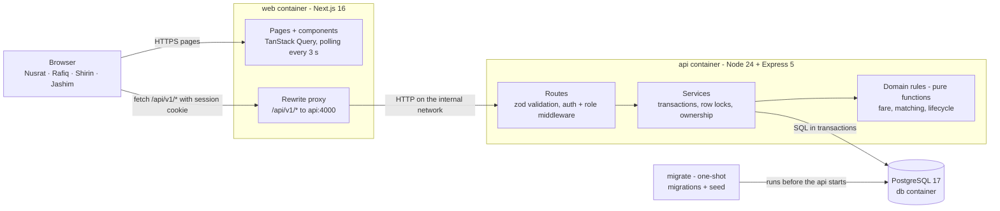
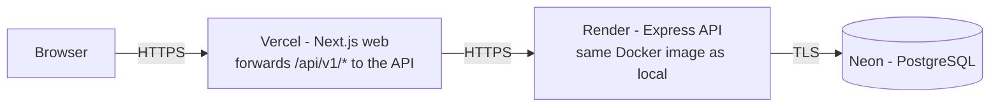

# Architecture

## System overview



| Container | Built from | Job |
|---|---|---|
| `web` | Next.js 16 on Node 24 | Passenger and driver screens. Forwards `/api/*` to the API so the browser only ever talks to one origin. |
| `api` | Node 24 + Express 5 | REST API: authentication, validation, business rules, transactions. |
| `db` | PostgreSQL 17 | Source of truth. Enforces the critical invariants itself (constraints, unique indexes). |
| `migrate` | the `api` image, one-shot | Applies migrations and seeds the story cast, then exits. The API starts only after it succeeds. |

**Why the browser only talks to Next.js:** the session lives in an HttpOnly cookie. When the API sits behind the same origin,
that cookie is first-party and no CORS setup is needed. It also matches the required flow:
Browser → Next.js → Node.js API → Database.

## What happens when Rafiq taps "Request"
1. The browser sends `POST /api/v1/rides` (with his session cookie) to the Next.js origin.
2. Next.js forwards it to `http://api:4000/api/v1/rides`.
3. `pino-http` gives the request an id and logs it.
4. `requireAuth` verifies the JWT in the cookie → `req.user = { id: Rafiq, role: PASSENGER }`; `requireRole('PASSENGER')` passes.
5. zod validates the body: pickup `BANANI`, drop-off `GULSHAN_1`, 1 seat, cash.
6. The controller calls the rides service.
7. The service looks up the distance (4 km), prices the ride (rule v1: 12 000 paisa), opens a transaction, inserts the ride
   as `REQUESTED` and writes a `RIDE_REQUESTED` event. A second active ride for Rafiq would hit a unique index → 409.
8. Matching: open pools at Banani with a free seat, oldest first → Bullet's pool. `claimSeats()` locks that pool row,
   sees Nusrat heading to Mohakhali (2 km from Gulshan 1) → compatible → seats 1 → 2 → ride `MATCHED` → event → COMMIT.
9. The API answers 201 with Rafiq's own ride: his fare, the number of co-riders, Bullet and Jashim — nothing about Nusrat.
10. Within ~3 s Jashim's dashboard poll shows Rafiq, and Nusrat's tracker shows "sharing with 1 other".

## Backend layers — where business logic lives

| Layer | Does | Never does |
|---|---|---|
| routes / controllers | HTTP: parse and validate input, call a service, shape the response | business rules |
| services | use cases: open transactions, lock rows, load data, call domain rules, write changes and events, check ownership | HTTP details |
| domain | pure rules: fare, matching, allowed transitions | touch the database or HTTP, so they are trivial to unit-test |
| db | schema, client, migrations, seed | business decisions |

The UI may hide a button, but **every rule is enforced on the server**.

## Deliberately not here
No Redis, message queues, microservices or WebSockets. One PostgreSQL database already gives atomic transactions and
row-level locks, which is everything the MVP needs for consistency; polling every few seconds is enough for a handful of
screens. Each of these would be added for a concrete reason at a larger scale, not to decorate the diagram.

## Project structure
```
apps/
  api/                        Express API (its image also runs the one-shot migrate service)
    src/
      config/env.ts           every setting, validated with zod at startup
      db/                     schema, client, migration runner, seed (the story cast)
      domain/                 pure rules: fare, geo (distance table), lifecycle, matching
      modules/                one folder per feature, routes + service:
                              auth · rides · driver · pools · events · reference (zones, fare estimate)
      middleware/             auth (requireAuth, requireRole), request logger, error handler
      lib/                    errors, logger, password hashing, session token, ids
      routes/health.ts        GET /health for Docker and hosting
      scripts/                migrate and seed entry points
    drizzle/                  SQL migrations (generated, reviewed, committed)
    test/                     Vitest + Supertest against a real PostgreSQL; test/domain = pure unit tests
    requests.http             the story as runnable HTTP requests
  web/                        Next.js app
    src/
      app/                    routes: (auth)/login, (auth)/register, passenger/…, driver/…, healthz
      components/             ride/ (passenger screens), driver/, ui/ (buttons, cards, fields)
      lib/                    API client, query keys, server-side session, formatting, types
      proxy.ts                sends signed-out visitors of /passenger and /driver to sign in
docs/                         architecture · domain · database · api · decisions · scaling · screenshots/
.github/workflows/ci.yml      API, web and docker compose checks on pull requests and the long-lived branches
docker-compose.yml · .env.example · README.md
```

## Deployment (planned, free tiers only)

