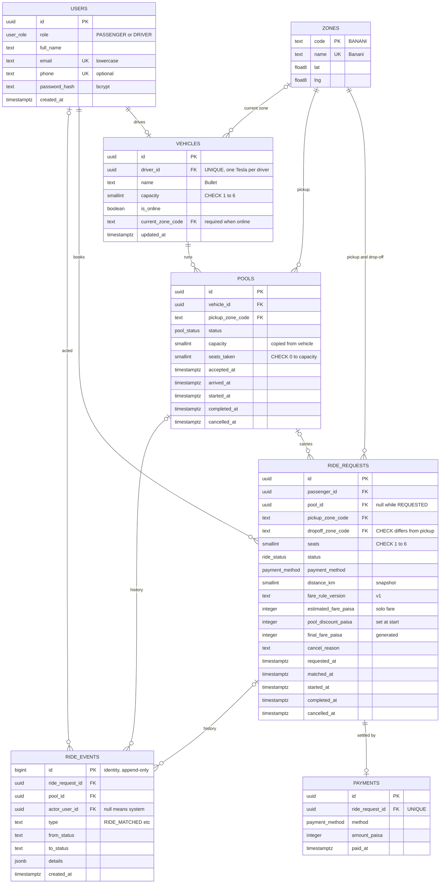

# Database

PostgreSQL 17. Schema defined with Drizzle ORM; migrations are generated SQL files, reviewed and committed.

## ERD

**Enums:** `user_role` (PASSENGER, DRIVER) · `ride_status` (REQUESTED, MATCHED, DRIVER_ARRIVED, STARTED, COMPLETED, CANCELLED) ·
`pool_status` (ACCEPTED, DRIVER_ARRIVED, STARTED, COMPLETED, CANCELLED) · `payment_method` (CASH, TESLAPAY)

## Why each table exists

| Table | Why it exists | Key rules |
|---|---|---|
| `users` | Everyone who logs in. One table for both roles because authentication is identical; `role` decides permissions. | email unique and lowercase; only the bcrypt hash is stored |
| `zones` | The fixed list of Dhaka areas. A foreign-key target, so a ride can't point to a zone that doesn't exist. | readable code as the primary key (`BANANI`) |
| `vehicles` | The Tesla, separate from the person, because capacity belongs to the vehicle. Online status and current zone live here because the Tesla is what gets matched. | one Tesla per driver; capacity 1–6; an online Tesla must have a zone |
| `pools` | One trip of one Tesla. It is the row we lock to make seat claims take turns, and it holds the trip's own status and timestamps. | `seats_taken` never above `capacity`; one active pool per Tesla |
| `ride_requests` | One passenger's booking, with its own status and fare. `pool_id` is the pool membership. | one active ride per passenger; a matched ride always has a pool; pickup ≠ drop-off; money in paisa |
| `ride_events` | Append-only history: who did what, when, and from which status to which. Status columns say where a ride is now; events say how it got there. | never updated or deleted; each row points to a ride, a pool, or both |
| `payments` | What was actually paid, kept apart from what was charged. Leaves room for TeslaPay and refunds. | one payment per ride |

**Why pool membership is a foreign key, not a join table:** a ride belongs to at most one pool in its whole life
(one-to-many), so `ride_requests.pool_id` is the simplest correct model, with no second table to keep in sync. A
`pool_members` join table would be needed if rides could move between pools, for example re-matching after a driver
cancels. That is a documented next step, not an MVP feature.

**Why a `pools` table at all, instead of a `vehicle_id` on each ride:** capacity belongs to a trip (several rides sharing one
Tesla at one time). We need one row per trip to lock, to enforce the seat limit on, and to hold the trip's own lifecycle.

## Constraints and indexes

| Table | Rule | Why |
|---|---|---|
| `pools` | `CHECK (seats_taken BETWEEN 0 AND capacity)` | the capacity rule, enforced by the database itself |
| `pools` | `UNIQUE (vehicle_id) WHERE status IN ('ACCEPTED','DRIVER_ARRIVED','STARTED')` | one active trip per Tesla |
| `pools` | index `(pickup_zone_code, accepted_at) WHERE status IN ('ACCEPTED','DRIVER_ARRIVED')` | fast auto-join search, oldest pool first |
| `ride_requests` | `UNIQUE (passenger_id) WHERE status IN ('REQUESTED','MATCHED','DRIVER_ARRIVED','STARTED')` | one active ride per passenger; blocks double-click duplicates |
| `ride_requests` | `CHECK ((status = 'REQUESTED' AND pool_id IS NULL) OR (status IN ('MATCHED','DRIVER_ARRIVED','STARTED','COMPLETED') AND pool_id IS NOT NULL) OR status = 'CANCELLED')` | a waiting ride never has a pool; a matched one always does |
| `ride_requests` | `CHECK (dropoff_zone_code <> pickup_zone_code)`, `CHECK (seats BETWEEN 1 AND 6)` | impossible rides can't be stored |
| `ride_requests` | `final_fare_paisa GENERATED ALWAYS AS (estimated_fare_paisa - pool_discount_paisa) STORED` and `CHECK (pool_discount_paisa BETWEEN 0 AND estimated_fare_paisa)` | the final fare always matches its parts, never exceeds the estimate, never goes negative |
| `ride_requests` | index `(pickup_zone_code, requested_at) WHERE status = 'REQUESTED'` | the driver's list of waiting rides, oldest first |
| `ride_requests` | index `(pool_id)`, index `(passenger_id, requested_at DESC)` | riders in a pool; a passenger's history |
| `vehicles` | `UNIQUE (driver_id)`, `CHECK (capacity BETWEEN 1 AND 6)`, `CHECK (NOT is_online OR current_zone_code IS NOT NULL)` | one Tesla per driver; sane capacity; online means located |
| `ride_events` | `CHECK (ride_request_id IS NOT NULL OR pool_id IS NOT NULL)`; indexes `(ride_request_id, id)`, `(pool_id, id)` | every event belongs to something; timelines load in order |
| all foreign keys | `ON DELETE RESTRICT` | history is never deleted by accident |

Note: a `CHECK` passes when its expression is NULL, which is why `NOT NULL` is declared separately wherever a value is required.

## Where each rule is enforced

| Rule | Database | Application |
|---|---|---|
| Seats never exceed capacity | CHECK | pool row lock + re-check before claiming |
| One active ride per passenger | partial unique index | friendly 409 message |
| One active pool per Tesla | partial unique index | Tesla row lock in the accept flow |
| A matched ride has a pool | CHECK | status and pool are set together |
| Final fare ≤ estimate | generated column + CHECK | fare function |
| Only allowed status changes | — (awkward in SQL) | transition table + compare-and-set update |
| Only the owner sees or cancels a ride | — | every query filtered by `passenger_id` |

## IDs and time
- **UUIDs** (`gen_random_uuid()`) for users, vehicles, pools, rides and payments: not guessable in URLs and safe to generate
  anywhere. Zones use readable codes. Events use a `bigint` identity (internal, naturally ordered).
  Trade-off: random UUIDs index slightly worse than sequential ids; irrelevant at MVP scale, and time-ordered UUIDv7 is the
  answer at larger scale.
- **Time** is stored as `timestamptz` (UTC) and shown in Asia/Dhaka.
