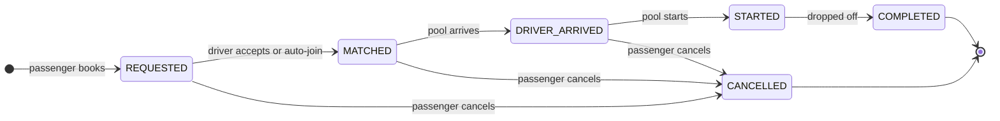
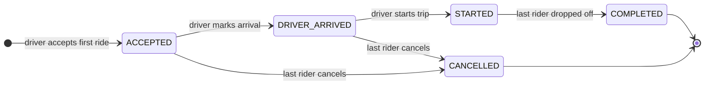
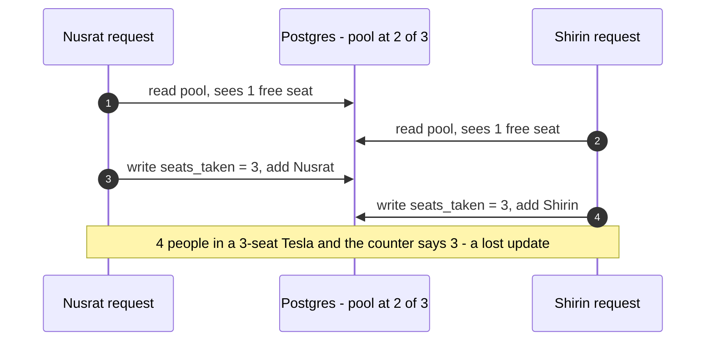
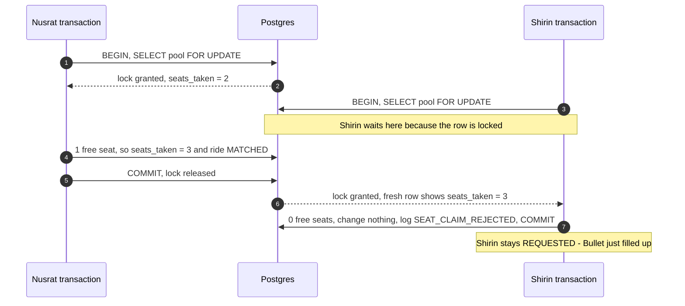

# Domain: rides, pools, matching, fares and the last seat

## Glossary
| Term | Meaning |
|---|---|
| **Passenger** | A user who books rides (Nusrat, Rafiq, Shirin). |
| **Driver** | A user who operates exactly one Tesla (Jashim). |
| **Tesla** | A three-wheeled battery rickshaw with a fixed seat capacity (Bullet = 3). |
| **Zone** | A predefined Dhaka area. Every pickup and drop-off is a zone. |
| **Ride** | One passenger's booking: pickup → drop-off, N seats, its own status and fare. |
| **Pool** | One trip of one Tesla from one pickup zone, carrying one or more rides. |
| **Pool membership** | A ride belongs to a pool through `ride_requests.pool_id`. |
| **Shared trip** | A pool that starts with at least two separate rides aboard. Everyone aboard gets the pool discount. |
| **Paisa** | 1/100 taka. All money is stored as whole paisa. |

---

## 1. Lifecycles

The brief suggests one lifecycle: `REQUESTED → MATCHED/ACCEPTED → DRIVER_ARRIVED → STARTED → COMPLETED (+ CANCELLED)`.

**The problem with a single lifecycle:** riders in a pool don't finish together. Nusrat gets off at Mohakhali while Rafiq
continues to Gulshan 1. One `COMPLETED` for the whole pool would either keep Nusrat "in progress" (and unpaid) after she is
home, or mark Rafiq finished before he arrives.

**Our improvement:** two linked state machines, keeping the brief's state names so they map one to one.
- The **pool** status is the Tesla's trip, managed by the driver. `ACCEPTED` is the driver-side name.
- The **ride** status is one passenger's journey. `MATCHED` is the passenger-side name.
- They move together until the trip starts, then split at drop-off: each passenger completes individually, and the pool
  completes when the last passenger is dropped off.

### Ride (per passenger)


### Pool (per Tesla trip)


### Transition rules
**Ride**
| From → To | Triggered by | Guard | Side effects (same transaction) |
|---|---|---|---|
| REQUESTED → MATCHED | system (auto-join) or driver (accept) | pool not started, matching rule passes, seats free | pool seats taken += seats; ride linked to pool; event |
| MATCHED → DRIVER_ARRIVED | the pool arrives | — | event. A ride that joins an already-arrived pool moves straight on to this state. |
| DRIVER_ARRIVED → STARTED | the pool starts | — | pool discount and final fare locked |
| STARTED → COMPLETED | driver drops this passenger off | ride is `STARTED` | cash payment recorded; if it was the last rider, the pool completes |
| REQUESTED / MATCHED / DRIVER_ARRIVED → CANCELLED | the passenger who owns the ride | trip not started | seats released; a pool left empty is cancelled; reason stored |

**Pool**
| From → To | Triggered by | Guard | Side effects |
|---|---|---|---|
| (new) → ACCEPTED | driver accepts a waiting ride | driver online in that pickup zone, no active pool | capacity copied from the Tesla |
| ACCEPTED → DRIVER_ARRIVED | the pool's driver | — | its `MATCHED` rides → `DRIVER_ARRIVED` |
| DRIVER_ARRIVED → STARTED | the pool's driver | at least one rider aboard | rides → `STARTED`; fares locked; closed to new riders |
| STARTED → COMPLETED | system | last rider dropped off | — |
| ACCEPTED / DRIVER_ARRIVED → CANCELLED | system | last rider cancelled | driver is free again |

Any other transition is rejected with **409 `INVALID_TRANSITION`**. The allowed transitions live in one table in code, and
every status change is a compare-and-set update (`UPDATE … WHERE id = $1 AND status = $expected`), so two simultaneous
attempts (a double-clicked "Start") cannot both succeed.

### What the passenger sees
| Status | Screen text |
|---|---|
| REQUESTED | Looking for a Tesla at Banani… |
| MATCHED | Matched with Bullet (Jashim), sharing with 1 other |
| DRIVER_ARRIVED | Bullet is at Banani, hop in |
| STARTED | On the way to Mohakhali |
| COMPLETED | Arrived · ৳75 paid in cash |
| CANCELLED | Cancelled (with the reason) |

---

## 2. Geography and matching

### Zones
`UTTARA` · `BASHUNDHARA` · `MIRPUR` · `BANANI` · `GULSHAN_2` · `GULSHAN_1` · `MOHAKHALI` · `TEJGAON` · `FARMGATE` · `DHANMONDI`

### Road-distance table (km)
Every fare and matching decision uses this table, so an evaluator can check any number by hand.

| km | UTTARA | BASHUNDHARA | MIRPUR | BANANI | GULSHAN_2 | GULSHAN_1 | MOHAKHALI | TEJGAON | FARMGATE | DHANMONDI |
|---|---|---|---|---|---|---|---|---|---|---|
| **UTTARA** | 0 | 14 | 11 | 13 | 14 | 16 | 16 | 18 | 18 | 20 |
| **BASHUNDHARA** | 14 | 0 | 12 | 8 | 7 | 8 | 10 | 12 | 13 | 16 |
| **MIRPUR** | 11 | 12 | 0 | 6 | 7 | 8 | 6 | 8 | 8 | 9 |
| **BANANI** | 13 | 8 | 6 | 0 | 2 | **4** | **3** | 5 | 6 | 9 |
| **GULSHAN_2** | 14 | 7 | 7 | 2 | 0 | 2 | 3 | 5 | 7 | 9 |
| **GULSHAN_1** | 16 | 8 | 8 | **4** | 2 | 0 | **2** | 4 | 5 | 8 |
| **MOHAKHALI** | 16 | 10 | 6 | **3** | 3 | **2** | 0 | 2 | 4 | 6 |
| **TEJGAON** | 18 | 12 | 8 | 5 | 5 | 4 | 2 | 0 | 2 | 5 |
| **FARMGATE** | 18 | 13 | 8 | 6 | 7 | 5 | 4 | 2 | 0 | 3 |
| **DHANMONDI** | 20 | 16 | 9 | 9 | 9 | 8 | 6 | 5 | 3 | 0 |

Values are straight-line distances between zone centres × 1.4 (a road factor), rounded to whole km. The story pairs (bold)
were set by hand. The table is symmetric, and no detour through a third zone is shorter than the direct trip; a unit test
keeps it that way.

### The matching rule
A waiting ride **R** can join pool **P** only if all four hold:
1. **P has not started** (status `ACCEPTED` or `DRIVER_ARRIVED`);
2. **same pickup:** R's pickup zone is P's pickup zone;
3. **enough seats:** P's free seats ≥ R's seats;
4. **nearby drop-offs:** for every rider already in P, the distance between their drop-off and R's drop-off is **≤ 3 km**.

**Worked examples.** Bullet's pool at Banani already carries Nusrat (→ Mohakhali) and Rafiq (→ Gulshan 1), with 1 seat left:

| Who | Check | Result |
|---|---|---|
| Rafiq, when only Nusrat was aboard | Banani = Banani ✓ · Gulshan 1 ↔ Mohakhali 2 km ✓ · 2 free ≥ 1 ✓ | joins |
| Shirin → Mohakhali, 1 seat | ↔ Mohakhali 0 ✓ · ↔ Gulshan 1 2 ✓ · 1 free ≥ 1 ✓ | joins; Bullet is full |
| Shirin → Tejgaon | ↔ Mohakhali 2 ✓ · ↔ Gulshan 1 **4 ✗** | waits |
| Shirin → Dhanmondi | ↔ Mohakhali **6 ✗** | waits |
| Shirin + her sister, 2 seats | 1 free < 2 ✗ | waits |
| Shirin from Gulshan 2 | different pickup ✗ | waits |

**Why this rule**
- *Same pickup:* the Tesla waits at one curb. Multi-pickup routing is out of scope.
- *Drop-offs at most 3 km apart* limits the detour. With Nusrat's stop first, Rafiq's extra distance is
  `3 + 2 − 4 = 1 km`, and by the triangle inequality the extra distance can never be more than the gap between the two
  drop-offs. So each extra stop adds at most 3 km to anyone's trip.
- *Every rider, not just one:* checking against everyone aboard means the result does not depend on who booked first,
  so the rule is applied consistently.
- *Rejected alternatives:* same pickup only (Uttara and Dhanmondi riders in one Tesla); a hand-written neighbour list
  (harder to justify); real route optimisation or map APIs (out of scope for the brief).

### How rides find pools
- **Auto-join when booking:** candidate pools are those with the same pickup, not started, and enough free seats, tried
  oldest first (the pool that has waited longest fills first and can leave sooner). The first one that passes the rule
  while locked wins. If none does, the ride waits as `REQUESTED`.
- **Driver accept:** Jashim sees waiting rides in his current zone. If he already has an open pool, he sees only rides that
  pass the rule and fit his free seats. Accepting creates his pool if he doesn't have one yet.
- Both paths go through the same `claimSeats()` function, so capacity is checked in exactly one place.

---

## 3. Fares and money

### Fare rule v1
| Constant | Value | Stored as |
|---|---|---|
| Base fare | ৳40 per seat | 4 000 paisa |
| Distance charge | ৳20 per km per seat | 2 000 paisa |
| Pool discount | 25 % | 2 500 basis points |

```
subtotal     = (BASE_FARE + PER_KM × distanceKm) × seats
poolDiscount = shared ? floor(subtotal × 2500 / 10000) : 0
fare         = subtotal − poolDiscount
shared       = the pool had at least 2 separate rides aboard when the trip started
```
For one seat this is exactly the brief's `baseFare + distanceCharge − poolDiscount`. All arithmetic is in integers. With
v1's numbers the discount always comes out to a whole multiple of ৳5, so no rounding happens in practice; the rule is
still defined (round down to the paisa).

### Hand check: Nusrat and Rafiq
| | Nusrat | Rafiq |
|---|---|---|
| Trip | Banani → Mohakhali | Banani → Gulshan 1 |
| Distance | 3 km | 4 km |
| Base | ৳40 | ৳40 |
| Distance charge | 3 × ৳20 = ৳60 | 4 × ৳20 = ৳80 |
| **Solo fare** (shown as the estimate) | **৳100** (10 000 paisa) | **৳120** (12 000 paisa) |
| Pool discount, 25 % | −৳25 | −৳30 |
| **Pooled fare** | **৳75** (7 500 paisa) | **৳90** (9 000 paisa) |

Jashim collects ৳165 for the shared trip, instead of ৳100 or ৳120 for a single solo trip. Other cases: Shirin → Mohakhali,
shared = ৳75; Rafiq and a colleague (2 seats) = ৳240 solo, ৳180 shared.

### When each number is decided
| Moment | What happens |
|---|---|
| Before booking | The estimate shows the solo fare (৳100) and the pooled fare (৳75). |
| Booking | The ride stores its distance, seats, rule version (`v1`) and the solo fare, which is the most the passenger will pay. |
| Trip start | Riders are fixed, so "shared" is known. Every rider's discount is stored and the final fare follows. |
| Drop-off | The cash payment is recorded at the final fare. |

**Why the discount is decided at the start:** that is when the group is final. A discount granted when a co-rider joins
could disappear if they cancel. Deciding at the start is simple and fair, and the final fare can never exceed the estimate
(the database enforces this too).

### Money is stored as integer paisa
- Floating point can't represent most decimals exactly: in JavaScript `0.1 + 0.2 === 0.30000000000000004`, so sums drift.
- PostgreSQL `NUMERIC` is exact, but the Node driver returns it as a string, so every calculation would need a decimal library.
- Integers are exact, fast and easy to add up; JavaScript numbers are exact integers up to 2⁵³.
- Columns are `INTEGER` (max ≈ ৳21.4 million per value, plenty for a fare). `BIGINT` is avoided because the driver returns it
  as a string as well.
- Money is converted to taka only for display (`Intl.NumberFormat('en-BD', { style: 'currency', currency: 'BDT' })`).
- We would switch if we needed several currencies (store the currency plus its minor units) or fractions of a paisa.

### Payment
Cash only in the MVP: each ride records its payment method (`CASH`), and a payment row with the final fare is written when
the driver drops the passenger off. A simulated TeslaPay wallet (balance plus an append-only transaction ledger) is a
documented next step.

---

## 4. Concurrency: the last seat

### The race
Bullet's pool has 2 of 3 seats taken. Nusrat and Shirin book at the same instant. Without protection, both read
"1 seat free" before either writes:



### The fix: take turns per pool, and let the database refuse bad data


**Five layers of defence**
1. **One row lock per pool.** Any change to a pool's riders happens in a transaction that first runs
   `SELECT … FROM pools WHERE id = $1 FOR UPDATE`, then re-checks status, seats and the matching rule on fresh data.
   Only that pool's row is locked; other pools are unaffected.
2. **A database invariant.** `CHECK (seats_taken BETWEEN 0 AND capacity)` on `pools`. Even buggy code cannot commit an
   overbooked pool. Capacity is copied onto the pool row because a CHECK can only see its own row.
3. **Uniqueness invariants:** one active ride per passenger and one active pool per Tesla (partial unique indexes), so double
   clicks cannot create duplicates.
4. **Compare-and-set status changes:** `UPDATE … WHERE id = $1 AND status = $expected`. Zero rows updated means someone
   else changed it first → re-read → 409.
5. **Consistent lock order and short transactions:** always Tesla → pool → ride, candidate pools in a fixed order,
   and no network calls inside a transaction. This avoids deadlocks and keeps waits short.

**Why this approach**
| Option | Verdict |
|---|---|
| `SELECT … FOR UPDATE` (chosen) | Simple, explicit, easy to explain and test. Contention is per pool (at most 3 seats), so tiny. |
| Conditional update (`SET seats_taken = seats_taken + n WHERE seats_taken + n <= capacity`) | Correct for a plain counter, but the matching rule also needs the current riders, so we would still want the lock. |
| `SERIALIZABLE` isolation | Correct, but every conflict becomes an error to retry, and it is harder to reason about. |
| Optimistic locking (version column) | Good for low contention; needs retry logic. |
| Redis lock or a queue | A new moving part without a need: one PostgreSQL already provides atomic transactions and locks. |

**At larger scale** the seat lock stays cheap (one row, three seats). What breaks first is the matching search and
real-time updates: we would partition matching by zone or geo-cell, give each partition a single worker fed by a queue (so
there is no lock contention at all), use idempotency keys so a retried booking cannot create two rides, and publish events
through an outbox table. The CHECK constraints stay as the final guard at any scale.

**How it is tested**
1. *Deterministic lock test:* connection A locks the pool; B's claim waits; A commits; B sees the pool full and is rejected.
2. *Parallel test:* Nusrat and Shirin book at the same moment, repeated 50 times. Each time exactly one joins, and
   seats taken = capacity = the sum of the active riders' seats.
3. *Constraint test:* a raw `UPDATE pools SET seats_taken = 4` fails with a check violation.
