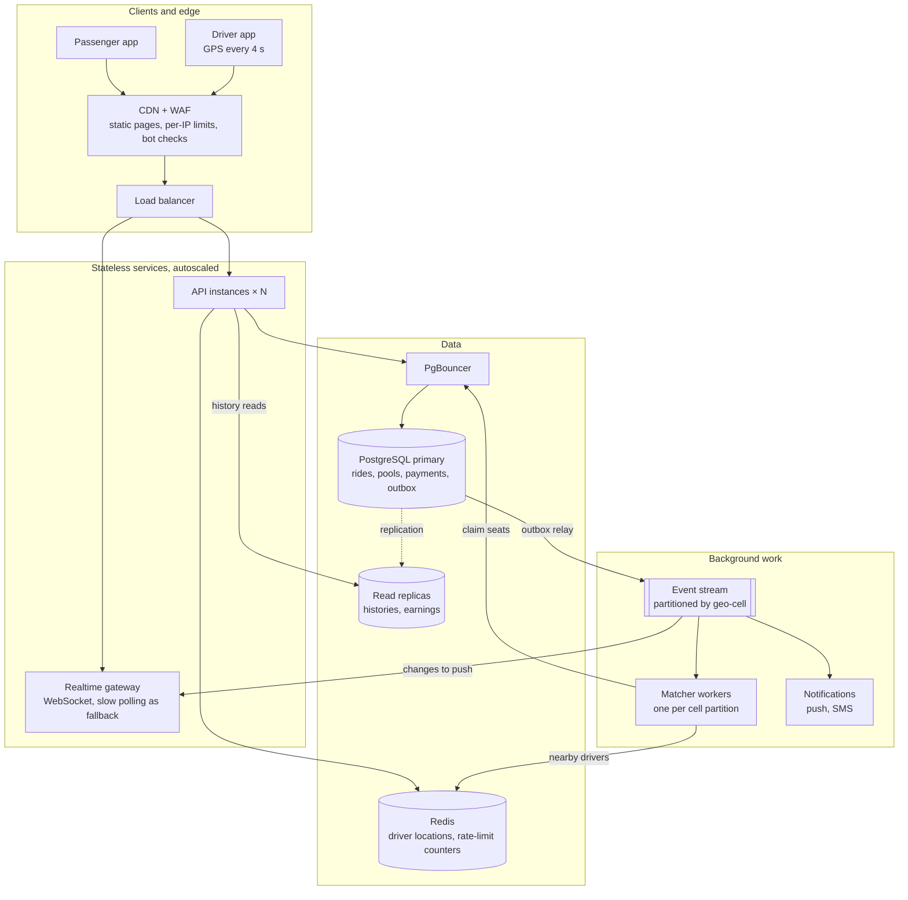

# If Oi Tesla goes viral: 1 million passengers, 100 000 drivers

The MVP is one API, one PostgreSQL database and screens that poll every 3 seconds. This document works out what would
break first at 1M passengers and 100k drivers, what we would change and in which order, and what we would keep.
Reasoning first, boxes second.

## 1. Back-of-the-envelope numbers

| Assumption | Value |
|---|---|
| Daily active passengers | 1M, about 2 rides each → **2M rides a day** |
| Busiest hour (office rush) | ~15 % of the day → 300k bookings an hour ≈ **85 bookings/s**, ×3 on a rainy Eid eve ≈ **250/s** |
| Drivers online at peak | ~50k of the 100k |
| Screens open at peak | ~150k passengers following a ride + 50k drivers = **200k screens** |

What that means for each part of today's design:

| Load | Today's design | At peak | Verdict |
|---|---|---|---|
| Bookings | ~5 SQL writes each (ride, pool, events) | 250/s × 5 ≈ **1 250 writes/s** | fine for one well-sized PostgreSQL primary |
| Polling | every open screen asks every 3 s | 200k ÷ 3 ≈ **67 000 requests/s**, almost all answering "nothing changed" | **breaks first**: ~270× the booking traffic |
| Driver locations | zones, set by hand | with real GPS every 4 s: 50k ÷ 4 ≈ **12 500 writes/s** | too much churn for PostgreSQL rows |
| Event history | one row per step | 2M rides × ~6 events = **12M rows a day** (4 billion a year) | needs partitioning and archiving |
| DB connections | 10 per API instance | 30 instances → 300 connections | needs a connection pooler |
| Seat claims | one row lock per pool, held for a few ms | a pool has 3 seats, so at most a handful of claims ever compete | **not the bottleneck** (see §4) |

The surprise is the point: the famous last-seat race is cheap to protect. The real costs are **reads that ask for nothing
new**, **location churn**, and **history volume**.

## 2. Target architecture

## 3. What changes, in the order it would hurt

### 3.1 Real-time: push instead of polling
Polling is the right MVP choice (stateless, works on any free host), and the wrong one at 200k screens. Clients
open a WebSocket (or Server-Sent Events) to a **realtime gateway** and subscribe to their own ride or pool. After a
change commits, the event reaches the gateway, which pushes it only to the people it concerns. Requests drop from 67k/s
to roughly the number of real changes (hundreds per second). The gateway holds connections, so it scales separately
from the stateless API. Mobile networks in Dhaka drop often, so clients keep a **slow poll (every 30 s) as a fallback**
and re-fetch the full state on reconnect. A push is a hint; the database stays the source of truth.

### 3.2 Horizontal scaling of the API
The API is already almost stateless: the session is a signed JWT in a cookie, so any instance can serve any request.
The one exception is the **in-memory rate-limit counters**: with N instances, each would allow 10 failed sign-ins, so an
attacker would get 10 × N. They move to Redis, shared by all instances. Behind a load balancer the instances then
autoscale on CPU and request latency.

### 3.3 Geospatial search instead of zones
Ten zones and a distance table keep the MVP hand-checkable. At scale, pickups are GPS points, and we need "online drivers
near this point" in milliseconds:
- **Driver locations live in Redis** (a geo index), not in PostgreSQL rows. They change every few seconds and are only
  useful while fresh, so durable storage is the wrong home. A sampled trail is written to cheap storage later, for
  disputes and analytics.
- **Space is cut into cells** (H3 hexagons or geohashes, ~500 m across). "Nearby" = this cell plus its neighbours.
  Cells are also the unit we partition matching by (§3.5).
- Durable geography (ride pickups and drop-offs) moves to PostGIS columns with a GiST index. Real road distances come
  from a self-hosted routing engine (OSRM) instead of the table.

### 3.4 The database
- **Indexes we already have still fit:** partial indexes on waiting rides and joinable pools stay small, because they
  only hold rows that are currently active, however much history piles up.
- **PgBouncer** in transaction mode, so hundreds of API connections share a few dozen real ones.
- **Read replicas** for history and earnings pages, which can be a second stale. Anything that decides seats or money
  reads the primary.
- **Partition `ride_events` by month** and archive old partitions to object storage; dropping a partition is instant,
  deleting a billion rows is not.
- **UUIDv7** keys instead of random UUIDs: time-ordered, so inserts land at the end of the index instead of all over it.
- One primary handles ~1–2k writes/s comfortably. If bookings outgrow it, **shard by city** (Dhaka, Chattogram…): rides
  never cross cities, so no transaction has to span shards.

### 3.5 Matching: from "first fit" to one matcher per cell
Today each booking runs `autoJoin()` itself: it tries the 5 oldest joinable pools at its pickup and keeps the first that
accepts it. Two weaknesses grow with traffic (§4 has the details): every booking in a busy area queues behind the same
oldest pool, and the result is greedy (first come, first matched), not the best grouping.

At scale, bookings become events on a stream **partitioned by geo-cell**, and **one matcher worker owns each partition**.
Within a cell there is a single writer, so bookings no longer race each other at all. The matcher collects requests for
a short window (~2 s) and picks the grouping with the most shared seats and the smallest detours, still within the
≤ 3 km drop-off rule. It commits each match through the same seat-claim logic, so the lock and the `CHECK` constraint
stay as the final guard against a bug in the clever part.

### 3.6 Events and queues: the outbox
Today a status change and its `ride_events` row are written in one transaction, which is exactly what an **outbox**
needs. A relay reads new rows and publishes them to the stream (Kafka or Redpanda). Consumers include the realtime
gateway, push and SMS notifications, receipts and analytics. This gives **at-least-once** delivery: an event may arrive
twice, so every consumer ignores event ids it has already handled. The alternative, "commit, then call the queue", loses
the event whenever the process dies between the two steps.

### 3.7 Idempotency and retries
Phones on mobile data resend requests. The MVP already turns most duplicates into harmless errors:
- a second booking hits the "one active ride per passenger" unique index → 409;
- a repeated drop-off or start fails its compare-and-set (`WHERE status = $expected`) → 409;
- `payments.ride_request_id` is unique, so a ride can never be paid twice.

What it can't do is tell the client "your first attempt worked". So `POST /rides` and the other commands accept an
**`Idempotency-Key`** header. The server stores (user, key) → response for 24 hours, and a retry gets the original
response back.

Retry rules:
- **Clients** retry only network errors, 5xx and 429 (honouring `Retry-After`), with exponential backoff and jitter.
  Never 4xx. The web app already refuses to retry 4xx.
- **The server** retries a transaction that fails with a deadlock or serialization error (`40P01`, `40001`) up to 3
  times.
- Every call to another service (maps, SMS) gets a timeout and a circuit breaker, and none happens inside a database
  transaction.

### 3.8 Caching, and what must never be cached
- Cache freely: zones or cells and fare rules (they change only with a deploy, versioned like `v1`); fare estimates
  keyed by (pickup, drop-off, seats, rule version); static pages at the CDN.
- Never cache: seat counts, ride status, or anything that decides money. Those are pushed when they change (§3.1) and
  read from the primary when they decide something.

### 3.9 Rate limiting and abuse
- **At the edge (CDN/WAF): per-IP limits.** The real client address is known there, unlike behind today's Next.js proxy
  (see `decisions.md`).
- **In Redis: per-account limits** on sign-in failures, bookings and cancellations, so one account can't book and cancel
  in a loop to keep drivers busy.
- **CAPTCHA or phone OTP** after repeated failures. Phone OTP becomes the main sign-in for most riders in Bangladesh
  anyway.

### 3.10 Observability
- **Logs:** structured JSON with a request id. We already have this (pino), with secrets redacted.
- **Metrics:** request rate, errors and latency per endpoint; DB pool saturation; replica lag; lock waits (the same
  `pg_stat_activity` signal our concurrency test uses).
- **Business metrics:**
  - time-to-match (p50/p95)
  - match rate
  - share rate (pools that start with 2+ riders)
  - seat-claim rejections by reason
  - cancellations
- **Tracing:** OpenTelemetry from gateway to API to database to workers, so a slow booking can be followed end to end.
- **SLOs with alerts:** for example, 99.9 % of bookings answered within 500 ms. Alerts fire when the error budget burns
  too fast, not on every spike.

### 3.11 Security
- **Sessions you can revoke.** Today's 24-hour JWT can't be cancelled early. At scale: short-lived access tokens
  (~15 min) plus refresh tokens stored server-side, so "log out everywhere" and bans take effect at once.
- **Key rotation.** Signing keys are rotated using a key id (`kid`).
- **Protecting phone numbers.** They are encrypted at rest and hidden between riders and drivers, who call each other
  through proxy numbers.
- **Least privilege.** The API's database role can't drop tables; secrets live in a secret manager.
- **Fraud checks:** fake bookings, GPS spoofing by drivers, and promo abuse.
- **Already in place:** an append-only `ride_events` table, which serves as the audit log.

### 3.12 Deployment
- **Region.** Containers run on a managed orchestrator (ECS or Kubernetes) in the cloud region closest to Dhaka
  (Mumbai or Singapore, ~30–60 ms away).
- **Database.** Multi-zone PostgreSQL with point-in-time recovery.
- **Releases.** Canary or blue-green deploys, with feature flags for matching changes so they can be switched off without
  a redeploy.
- **Expand → migrate → contract migrations.** Every schema change is backwards-compatible for one release, because old
  and new API versions run side by side during a deploy.
- **Infrastructure as code,** so a region can be rebuilt from scratch.

## 4. Database contention, looked at honestly
The seat lock itself is cheap: it covers one pool row, held for a few milliseconds, and a pool has only 3 seats.
Two real hot spots appear before it:
1. **The oldest pool in a busy area.** `autoJoin()` tries pools oldest first, so simultaneous bookings at the same
   pickup all queue on that one row. The quick fix is `FOR UPDATE SKIP LOCKED` on the candidate search: a booking that
   finds a pool locked moves on to the next one instead of waiting. The full fix is the single matcher per cell (§3.5),
   which removes the contention entirely.
2. **Locks held on pools that said no.** A booking that tries several candidates keeps each one locked until its
   transaction commits (row locks last until the end of a transaction). Today that is at most 5 short locks. With
   `SKIP LOCKED` and a single matcher it disappears.

Lock order stays Tesla → pool → ride, and transactions stay short with no network calls inside, so deadlocks remain rare.
When one happens, it is retried (§3.7).

## 5. What we keep, at any scale
- **`CHECK (seats_taken BETWEEN 0 AND capacity)` and the partial unique indexes.** The database refuses overbooking and
  duplicates even if every layer above it has a bug.
- **One seat-claim function with a compare-and-set on status.** It is the single door into a pool, whoever calls it.
- **The pure domain rules (fare, matching, lifecycle),** unit-tested and versioned (`v1`), so prices can change without
  changing history.
- **Money as integer paisa,** and the append-only event history.

## 6. A phased path (don't build stage 3 on day one)
| Stage | Riders | Add |
|---|---|---|
| 1 | up to ~10k | today's design + metrics and alerts, a paid always-on host, backups |
| 2 | up to ~100k | several API instances behind a load balancer, Redis for rate limits, PgBouncer, a read replica, Server-Sent Events instead of polling, idempotency keys, `SKIP LOCKED` |
| 3 | 1M riders / 100k drivers | GPS + Redis geo index, cell-partitioned matcher workers on an event stream, outbox, WebSocket gateway, partitioned `ride_events`, multi-zone deploys |

Each step is triggered by a measured limit (latency, lock waits, connection count), not by the size of the diagram.
